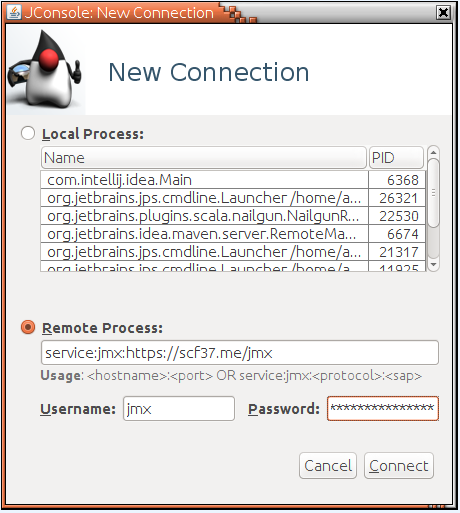

JMX-HTTP Connector
==================

A JMX connector (client and server) that runs JMX through HTTP (or HTTPS). It does one job and do it well.

### How to connect?
Use self-contained <a href=launchers>launcher scripts</a> for jconsole/jmc/jvisualvm, they will automatically download jmx client jar and set up the classpath.

Then connect with JMX service URL: `service:jmx:http(s)://${host}:${port}/jmx`

### Setting up JMX server
#### Add dependencies

pom.xml:
```xml
<dependency>
        <groupId>me.scf37.jmx-http</groupId>
        <artifactId>jmx-http-server</artifactId>
        <version>1.0.0</version>
</dependency>
```

#### Add JMX HTTP endpoint to your application 
```java
@PostMapping("/jmx")
public byte[] serveJmx(@RequestBody byte[] request) {
    try {
        return JmxHttpServer.serve(request).get();
    } catch (Exception e) {
        throw new RuntimeException(e);
    }   
}
``` 
Similar approach is used for other web servers/frameworks - POST to any url, request and response bodies are binary.

### Why?

This connector is intended to be used in cases where you'll already have an HTTP port open. This gives it the following advantages:

 * HTTP generally punches through firewalls.
 * An existing port can be used.
 * HTTP is already supported by a lot of network infrastructure.
 * Piggy backs on your existing HTTP infrastructure for authentication, authorization and encryption.
 * This connector is quite lightweight
 * The protocol runs plain Java Serialization over HTTP, not XML or even SOAP.
 * notifications are done with long poll for maximum compatibility and low latency
 * No dependencies other than Java SE 8

### What about security?

Per default no security is applied. You can either embed security in your application or hide it behind reverse proxy. The client supports HTTP Basic authentication.

### What about load balancing?

You should not connect to the application through a load balancer since you want to monitor a specific server rather than a "random" one.

### Protocol

The client serializes each request to byte array and POSTs it to server. The server deserializes the command and executes it. Afterwards the result is serialized and sent back to the client.
